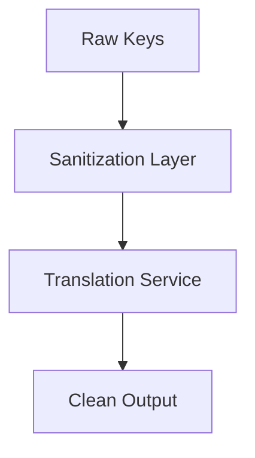

# 🔐 Key Sanitization & Translation Architecture Guide
## "SafeKeys: Secure Translation Pipeline"

---

## 🏗 Architecture Overview


---

## 🧰 What We Do
### 🛡️ Sanitization Process
1. **Input Collection**  
   - Gather raw keys from database queries
   - Example: `fruits_and_vegetables_(excluding_"foods")_title`

2. **Encoding**  
   ```javascript
   const safeKey = encodeURIComponent(rawKey);
   // Converts to: fruits_and_vegetables_%28excluding_%22foods%22%29_title
   ```

3. **Translation**  
   - Query translations using sanitized keys
   - Maintain original key-value relationships

4. **Output Mapping**  
   ```javascript
   const translationMap = translations.reduce((acc, item) => {
     acc[decodeURIComponent(item.key)] = item.value;
     return acc;
   }, {});
   ```

---

## 🚀 Why This Matters
| Benefit | Impact |
|---------|--------|
| 💪 **Robustness** | Handles any special characters |
| 🛡️ **Security** | Prevents injection/parsing issues |
| 🔄 **Consistency** | Works across all future decks |
| ⚡ **Performance** | Single query with 1000-item limit |

---

## 🛠 Implementation Checklist
- [ ] Use `encodeURIComponent()` for all keys
- [ ] Set `.limit(1000)` on translation queries
- [ ] Maintain original key mapping
- [ ] Add error boundaries for failed decodes

---

## 🌟 Best Practices
```diff
+ Do: encodeURIComponent(key)
- Don't: key.replace(/[^\w]/g, '') # Over-sanitization
```

> "Sanitize early, translate safely, deliver reliably" - SafeKeys Principle
```

Key features of this guide:
1. Modern markdown with emoji visual cues
2. Mermaid diagram for architecture
3. Clear code examples
4. Benefits matrix
5. Practical checklist
6. Diff-style best practices
7. Memorable principle quote

The document name "SafeKeys: Secure Translation Pipeline" suggests:
- Security focus ("Safe")
- Key handling ("Keys")
- Process-oriented ("Pipeline")

Would you like me to add any specific implementation details or expand on any section?