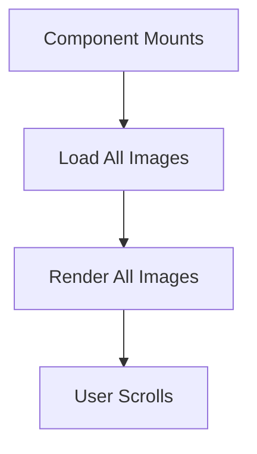
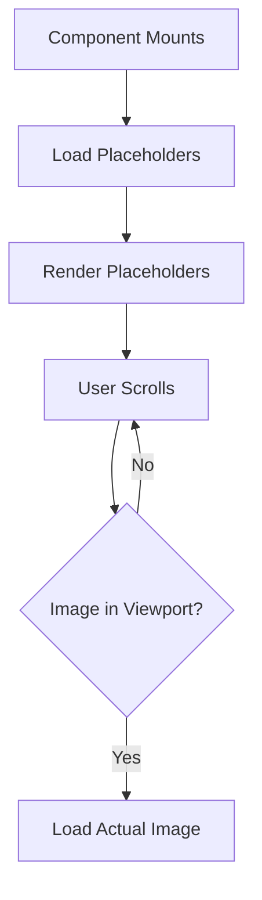

# DeckImageSelector Optimization Plan

## Overview
This document outlines the optimization plan for DeckImageSelector component to improve performance and user experience.

## Current vs Lazy Loading Comparison

### Current Loading Flow

- Loads all images immediately on component mount
- Higher initial bandwidth usage
- Slower initial render time
- Better for small datasets

### Proposed Lazy Loading Flow

- Loads only images in/near viewport
- Lower initial bandwidth usage
- Faster initial render time
- Better for large datasets

🔄 **Key Differences**
| Aspect | Current | Lazy Loading |
|--------|---------|--------------|
| Initial Load | All images | Placeholders only |
| Bandwidth | High | Optimized |
| Performance | Slower | Faster |
| Best For | Small datasets | Large datasets |

## Optimization Tasks

### 1. Lazy Loading Implementation
- [ ] Create Intersection Observer utility component
- [ ] Modify image components to support lazy loading
- [ ] Implement placeholder components for unloaded images
- [ ] Configure optimal thresholds for loading triggers
- [ ] Integrate lazy loading with existing component structure
- [ ] Test lazy loading implementation across different viewports

### 2. Supabase Query Optimization
- [ ] Review and optimize database queries
- [ ] Implement pagination for large datasets
- [ ] Add proper indexing for frequently queried fields

### 3. Performance Monitoring
- [ ] Set up React Profiler for component performance
- [ ] Add performance metrics logging
- [ ] Establish baseline performance benchmarks

## Implementation Steps
1. [ ] First implement lazy loading functionality
2. [ ] Optimize database queries and pagination
3. [ ] Set up performance monitoring tools
4. [ ] Test and measure performance improvements
5. [ ] Deploy optimizations to production

## Expected Benefits
- Faster initial load times
- Reduced bandwidth usage
- Smoother scrolling experience
- Better overall performance metrics